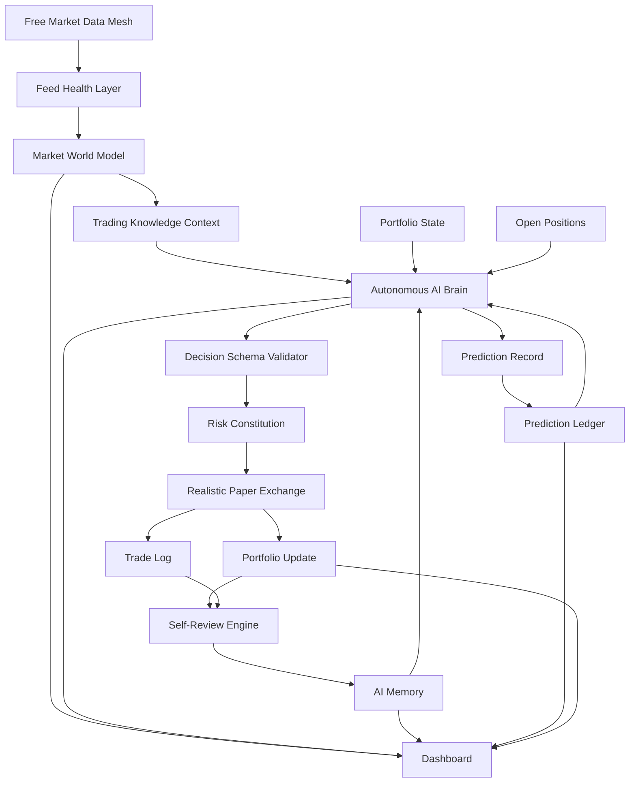

# Autonomous AI Paper Trading Agent Architecture

Version: 1.0
Date: 2026-05-30
Project Context: Next.js autonomous paper trading system

## Purpose Of This Document

This document is a complete, shareable architecture brief for building a free, autonomous AI paper trading system.

It is designed to be uploaded into another AI chat or used by a developer as the implementation guide for the next phase of the project.

The project already exists as a Next.js application with:

- A human-vs-AI paper trading dashboard.
- API routes for trading, prices, charts, signals, reset, backtest, and manual trading.
- Redis-backed portfolio state.
- Market data fetching.
- Technical indicators.
- Risk management.
- Gemini AI integration.
- Telegram alerts.
- GitHub/Vercel scheduling.

The goal is not to replace the existing build. The goal is to evolve it into a much more advanced free autonomous AI paper trader.

## Core Philosophy

The title of the project is the philosophy:

**Autonomous Paper Trading Agent**

This system is not primarily a dashboard, not primarily a strategy tournament, and not primarily a manual trading simulator.

It is an autonomous AI trader.

The human-vs-AI feature stays because it is fun and gives the system a clear arena. But the human is the benchmark. The AI is the central autonomous intelligence.

Everything in the system must serve AI autonomy:

- Market data gives the AI senses.
- Indicators give the AI technical evidence.
- Statistics give the AI mathematical context.
- Sentiment gives the AI crowd psychology.
- Risk management gives the AI account physics.
- Paper execution gives the AI realistic consequences.
- Prediction tracking gives the AI measurable accountability.
- Self-review gives the AI learning.
- Memory gives the AI continuity.
- The dashboard gives humans visibility into the AI mind.

The operating loop is:

```text
Observe market
Build market belief
Apply trading knowledge
Make autonomous decision
Validate decision format
Pass through risk constitution
Simulate realistic paper execution
Update portfolio
Record predictions
Review outcomes
Store memory
Improve future decisions
```

## Non-Negotiable Constraints

The architecture must respect these constraints:

1. The system must remain free to operate as much as realistically possible.
2. The system must use free APIs, free tiers, public data sources, and existing free hosting where possible.
3. The system must remain a paper trading system.
4. The AI must be the autonomous trader.
5. Human-vs-AI must remain as the arena.
6. The AI must be more advanced than the human side.
7. The AI should not merely validate deterministic signals. It should make full autonomous trade decisions.
8. Paper trading must become more realistic through simulated slippage, fees, spread, bad fills, stale data checks, and gap behavior.
9. The system must track whether the AI was actually correct over time.
10. The AI must remember its own mistakes and successful patterns.

## Existing System Assumptions

The current system includes or is expected to include files similar to:

```text
src/lib/market.ts
src/lib/signals.ts
src/lib/riskManager.ts
src/lib/portfolio.ts
src/lib/gemini.ts
src/lib/telegram.ts
src/lib/types.ts
src/app/api/trade/route.ts
src/app/api/trade/manual/route.ts
src/app/api/trade/scalp/route.ts
src/app/api/user/status/route.ts
src/app/api/user/reset/route.ts
src/app/api/prices/route.ts
src/app/api/chart/route.ts
src/app/api/signals/route.ts
src/components/Dashboard.tsx
```

This architecture should be implemented incrementally on top of those foundations.

## Target Final System

The final system should become:

**A free autonomous AI paper trading arena where a human manually competes against an evolving AI trading brain that observes free market data, builds a structured market worldview, makes its own trade decisions, executes through a realistic paper exchange, tracks predictions, reviews mistakes, stores memory, and improves future decisions.**

## High-Level System Diagram



## Major Architecture Sections

The system should be implemented as these major layers:

1. Free Data Mesh
2. Feed Health Layer
3. Market World Model
4. Trading Knowledge Layer
5. Autonomous AI Brain
6. Prompt And Schema System
7. Risk Constitution
8. Realistic Paper Exchange
9. Prediction Ledger
10. AI Memory
11. Self-Review Engine
12. Autonomous Cycle Route
13. AI Position Management
14. Human-vs-AI Arena Dashboard
15. Free Scheduling And Resource Strategy
16. Security Layer
17. Testing And Verification
18. Implementation Phases

Each section is described below in implementation-level detail.

---

# 1. Free Data Mesh

## Purpose

The Free Data Mesh collects market data from free or public data sources, normalizes it, caches it, scores its reliability, and passes it to the rest of the AI system.

This layer gives the AI its market senses.

## Current Foundation

Existing file:

```text
src/lib/market.ts
```

This likely already supports:

- Current price fetching.
- Candle fetching.
- Kraken for crypto.
- Yahoo Finance fallback.
- CoinGecko fallback.
- Redis caching.

## New Files

```text
src/lib/data/freeDataMesh.ts
src/lib/data/feedHealth.ts
src/lib/data/sourceAgreement.ts
src/lib/data/sentiment.ts
src/lib/data/cachePolicy.ts
```

## Free Data Sources

Potential free sources:

- Kraken public API for crypto candles and prices.
- CoinGecko Demo/free API for broad crypto fallback, metadata, and market stats.
- Alternative.me Fear and Greed Index for free crypto sentiment.
- Yahoo Finance chart endpoint as an unofficial fallback for forex and commodities.

Important behavior:

- Kraken should be the primary crypto source where possible.
- CoinGecko should be secondary or metadata/sentiment support, not spammed.
- Yahoo Finance should be treated as useful but unofficial and lower trust.
- Free APIs must be cached aggressively.
- If data quality is weak, AI should know and reduce confidence or refuse to trade.

## Output Type

```ts
export interface FreeMarketFrame {
  asset: string;
  category: "crypto" | "forex" | "commodity";
  timeframe: "1m" | "5m" | "15m" | "30m" | "1h" | "4h";
  candles: Candle[];
  currentPrice: number;
  primarySource: "KRAKEN" | "YAHOO" | "COINGECKO" | "CACHE";
  fallbackUsed: boolean;
  cacheAgeSeconds: number;
  stale: boolean;
  sourceAgreementScore: number;
  feedHealth: "GOOD" | "DEGRADED" | "BAD";
  warnings: string[];
  sentiment?: SentimentSnapshot;
}
```

## Required Behavior

The mesh must:

- Fetch candles by asset and timeframe.
- Fetch current prices.
- Use Redis cache to reduce external calls.
- Normalize all candles into one shared `Candle` type.
- Detect stale candles.
- Detect missing candle segments.
- Detect impossible price jumps.
- Compare sources when available.
- Return warnings instead of hiding data issues.
- Prevent downstream modules from treating weak data as strong data.

## Granular Situations

### Fresh Primary Source

If Kraken returns fresh BTC candles:

- `primarySource = "KRAKEN"`
- `fallbackUsed = false`
- `feedHealth = "GOOD"`
- `stale = false`

AI can trade normally.

### Fallback Source Used

If Kraken fails but Yahoo returns usable candles:

- `primarySource = "YAHOO"`
- `fallbackUsed = true`
- `feedHealth = "DEGRADED"`
- add warning: `"Primary source failed, fallback used"`

AI can still trade, but confidence should be reduced.

### Stale Data

If latest candle is older than expected:

- `stale = true`
- `feedHealth = "BAD"`
- add warning: `"Latest candle is stale"`

AI should not open new positions.

### Source Disagreement

If Kraken price and CoinGecko price differ significantly:

- lower `sourceAgreementScore`
- set `feedHealth = "DEGRADED"` or `"BAD"`
- add warning: `"Source price disagreement detected"`

AI should likely hold or reduce size.

### API Failure

If all providers fail:

- return no tradable frame
- mark asset as untradable for this cycle
- do not allow AI to invent prices

## Implementation Notes

This layer should not make trading decisions. It only gives the AI trusted market context.

---

# 2. Feed Health Layer

## Purpose

The Feed Health Layer evaluates whether the market data is safe enough for autonomous decision-making.

AI autonomy is only useful if the AI knows whether its information is reliable.

## New File

```text
src/lib/data/feedHealth.ts
```

## Health Metrics

Track:

- last successful fetch timestamp
- cache age
- candle count
- duplicate timestamps
- missing candles
- zero volume anomalies
- abnormal high-low ranges
- source disagreement
- API failure streak
- timeout count
- fallback frequency

## Output Type

```ts
export interface FeedHealthReport {
  asset: string;
  timeframe: string;
  status: "GOOD" | "DEGRADED" | "BAD";
  score: number;
  stale: boolean;
  missingCandles: number;
  duplicateCandles: number;
  sourceAgreementScore: number;
  lastUpdated: string;
  warnings: string[];
}
```

## Health Scoring

Suggested scoring:

- Start at 100.
- Subtract 20 for stale data.
- Subtract 15 for fallback source.
- Subtract 20 for large source disagreement.
- Subtract 10 for missing candles.
- Subtract 10 for zero volume when volume is expected.
- Subtract 20 for API failure streak.

Status:

- `GOOD`: score >= 80
- `DEGRADED`: score 50 to 79
- `BAD`: score < 50

## Granular Trading Impact

If feed health is:

- `GOOD`: AI can trade normally.
- `DEGRADED`: AI can trade only with lower confidence or smaller size.
- `BAD`: AI cannot open new trades.

This must be enforced later by the Risk Constitution.

---

# 3. Market World Model

## Purpose

The Market World Model is the AI's structured understanding of the market.

Raw candles and indicators are not enough. The AI needs a coherent worldview:

- What kind of market is this?
- Who is in control?
- Is price trending or ranging?
- Is volatility expanding or compressing?
- Is this a real breakout or a trap?
- Should a trader participate or wait?

## New File

```text
src/lib/ai/marketWorldModel.ts
```

## Inputs

- FreeMarketFrame
- IndicatorSeries
- StatisticalMetrics
- Recent candles
- FeedHealthReport
- SentimentSnapshot
- Existing SignalEngine output
- Portfolio context

## Output Type

```ts
export interface MarketWorldModel {
  asset: string;
  timestamp: string;
  price: number;
  category: "crypto" | "forex" | "commodity";

  regime:
    | "TRENDING"
    | "MEAN_REVERTING"
    | "RANDOM"
    | "VOLATILITY_SQUEEZE"
    | "PANIC"
    | "BREAKOUT"
    | "FAKEOUT_RISK"
    | "NO_TRADE";

  directionalBias: "BULLISH" | "BEARISH" | "NEUTRAL";
  trendStrength: number;
  momentumScore: number;
  volatilityPercentile: number;
  reversalRisk: number;
  breakoutQuality: number;
  fakeoutRisk: number;
  meanReversionScore: number;
  volumeConfirmation: number;

  supportZones: number[];
  resistanceZones: number[];
  nearestSupport?: number;
  nearestResistance?: number;

  sentimentState: "EXTREME_FEAR" | "FEAR" | "NEUTRAL" | "GREED" | "EXTREME_GREED" | "UNKNOWN";
  dataHealth: "GOOD" | "DEGRADED" | "BAD";
  tradeabilityScore: number;
  noTradeReasons: string[];

  summary: string;
}
```

## Calculated Components

### Regime

Use:

- Hurst exponent.
- Regression slope and R2.
- ATR percentile.
- Bollinger width.
- EMA alignment.
- RSI behavior.
- Volume behavior.

Possible logic:

- Strong slope plus high R2 -> `TRENDING`
- Low Hurst or range-bound behavior -> `MEAN_REVERTING`
- Low volatility and compressed bands -> `VOLATILITY_SQUEEZE`
- Extreme volatility and large candle ranges -> `PANIC`
- Break above resistance with volume -> `BREAKOUT`
- Break above resistance without volume -> `FAKEOUT_RISK`
- Conflicting signals -> `RANDOM`

### Directional Bias

Use:

- EMA stack.
- Price relative to VWAP.
- MACD histogram.
- RSI position.
- Recent high/low structure.
- Volume confirmation.

Bias should be:

- `BULLISH`
- `BEARISH`
- `NEUTRAL`

### Tradeability Score

Score 0 to 100.

High tradeability requires:

- feed health not bad
- clear regime
- sufficient volatility
- good risk/reward distance
- no major disagreement between signals
- no severe recent AI failure on similar setup

Low tradeability if:

- data stale
- market random
- volatility extreme
- fakeout risk high
- no clear invalidation
- support/resistance too close

## Granular Situations

### Strong Trend Continuation

Conditions:

- EMA9 > EMA21 > EMA50
- price above VWAP
- MACD histogram positive
- regression slope positive
- volume confirms

World model:

- `regime = "TRENDING"`
- `directionalBias = "BULLISH"`
- high trendStrength
- moderate reversalRisk

AI can consider BUY.

### Weak Breakout

Conditions:

- price breaks resistance
- volume is weak
- RSI overextended
- candle wick large

World model:

- `regime = "FAKEOUT_RISK"`
- high fakeoutRisk
- lower tradeability

AI should likely HOLD.

### Volatility Squeeze

Conditions:

- Bollinger width low
- ATR percentile low
- volume quiet

World model:

- `regime = "VOLATILITY_SQUEEZE"`
- direction may be neutral
- AI should wait for confirmation or prepare conditional thesis.

### Panic

Conditions:

- huge candle ranges
- ATR percentile extreme
- price far from VWAP
- volume spike

World model:

- `regime = "PANIC"`
- high risk
- AI should avoid chasing unless clear reversal logic exists.

---

# 4. Trading Knowledge Layer

## Purpose

The AI must use global trading knowledge, but not as separate competing bots.

This layer gives the AI relevant trading concepts based on the current market world model.

## New File

```text
src/lib/ai/tradingKnowledge.ts
```

## Knowledge Categories

Include compact knowledge for:

- trend continuation
- mean reversion
- breakout trading
- fake breakout avoidance
- volatility squeeze
- VWAP behavior
- EMA trend structure
- RSI momentum and divergence
- MACD momentum
- Bollinger Band expansion and compression
- ATR-based stop placement
- support and resistance
- liquidity sweeps
- fair value gaps
- Wyckoff accumulation/distribution ideas
- no-trade conditions
- risk/reward theory
- confidence calibration

## Output Type

```ts
export interface KnowledgeContext {
  activeConcepts: string[];
  preferredBehaviors: string[];
  warnings: string[];
  noTradeConditions: string[];
  riskGuidance: string[];
}
```

## Selection Logic

Do not send every concept every time.

Select based on regime:

- `TRENDING`: trend continuation, pullback entries, trailing stops.
- `MEAN_REVERTING`: VWAP, RSI extremes, range boundaries.
- `VOLATILITY_SQUEEZE`: breakout confirmation, fakeout risk.
- `PANIC`: volatility risk, avoid chasing, reduced sizing.
- `FAKEOUT_RISK`: failed breakout logic, wait for confirmation.
- `RANDOM`: no-trade discipline.

## Example

If world model says `VOLATILITY_SQUEEZE`, inject:

```text
Volatility squeeze knowledge:
- Compressed volatility often precedes expansion.
- Direction is uncertain until breakout confirmation.
- Volume confirmation matters.
- False breakouts are common.
- Avoid entering before confirmation unless risk is tightly defined.
```

---

# 5. Autonomous AI Brain

## Purpose

The Autonomous AI Brain is the central trader.

It is not a validator. It is not a commentary engine. It is the decision-maker.

## Current File To Evolve

```text
src/lib/gemini.ts
```

## New Files

```text
src/lib/ai/autonomousBrain.ts
src/lib/ai/prompts/autonomousDecisionPrompt.ts
src/lib/ai/schemas.ts
```

## Inputs

```ts
export interface AutonomousBrainInput {
  asset: string;
  worldModel: MarketWorldModel;
  signal: CompositeSignal;
  indicators: IndicatorSnapshot;
  statistics: StatisticalMetrics;
  portfolio: Portfolio;
  openPosition?: OpenPosition | null;
  memory: MemoryLesson[];
  predictionStats: PredictionPerformanceSummary;
  knowledge: KnowledgeContext;
  feedHealth: FeedHealthReport;
}
```

## Output

```ts
export interface AutonomousDecision {
  id: string;
  timestamp: string;
  asset: string;
  action: "BUY" | "SELL" | "SHORT" | "COVER" | "HOLD";
  confidence: number;
  conviction: "LOW" | "MEDIUM" | "HIGH";

  marketThesis: string;
  entryReason: string;
  holdReason?: string;
  invalidationCondition: string;

  expected15mDirection: "UP" | "DOWN" | "SIDEWAYS";
  expected1hDirection: "UP" | "DOWN" | "SIDEWAYS";
  expected4hDirection: "UP" | "DOWN" | "SIDEWAYS";

  stopLoss: number | null;
  takeProfit: number | null;
  positionSizeUsd: number;
  expectedValueScore: number;

  riskNotes: string[];
  memoryUsed: string[];
  dataConcerns: string[];
}
```

## Required AI Reasoning

The AI must answer:

- What is the current market state?
- Is there an edge?
- Why trade now?
- Why not wait?
- What proves the trade wrong?
- What is the likely next movement?
- What is the stop?
- What is the target?
- How much paper capital should be used?
- What past memory applies?
- What risks should reduce confidence?

## Actions

### BUY

AI opens a long position if:

- bullish thesis is strong
- expected value is positive
- stop and target are logical
- data health allows it
- risk constitution allows it

### SHORT

AI opens a short position if:

- bearish thesis is strong
- expected value is positive
- stop and target are logical
- data health allows it
- risk constitution allows it

### SELL

AI closes a long if:

- thesis invalidated
- take profit reached
- stop loss reached
- better risk-adjusted decision is to exit

### COVER

AI closes a short if:

- bearish thesis invalidated
- take profit reached
- stop loss reached
- better risk-adjusted decision is to exit

### HOLD

AI holds if:

- no edge
- data is bad
- market is random
- risk/reward is weak
- position should not be changed

Important: HOLD is an autonomous decision. It is not inactivity.

---

# 6. Prompt And Schema System

## Purpose

The AI can be sovereign, but its output must be structured.

No vague natural language should directly execute trades.

## New Files

```text
src/lib/ai/prompts/autonomousDecisionPrompt.ts
src/lib/ai/schemas.ts
```

## Prompt Structure

The decision prompt should contain:

1. Role:
   - "You are the autonomous AI paper trading brain."

2. Objective:
   - "Grow paper equity while avoiding destructive drawdown."

3. Market World Model:
   - structured JSON

4. Portfolio:
   - cash
   - open positions
   - drawdown
   - recent performance

5. Technical Evidence:
   - signal
   - key indicators
   - statistical metrics

6. Relevant Trading Knowledge:
   - only selected concepts

7. Memory:
   - relevant past lessons

8. Data Quality:
   - feed health warnings

9. Output Schema:
   - strict JSON only

## Schema Rules

Use Zod.

Validation rules:

- `action` must be valid.
- `confidence` must be between 0 and 1.
- `conviction` must be LOW, MEDIUM, or HIGH.
- BUY and SHORT require stopLoss and takeProfit.
- BUY stopLoss must be below entry.
- BUY takeProfit must be above entry.
- SHORT stopLoss must be above entry.
- SHORT takeProfit must be below entry.
- positionSizeUsd must be non-negative.
- HOLD must include holdReason.
- BAD data health cannot allow BUY or SHORT.

## Failure Handling

If AI returns invalid JSON:

- retry once with repair prompt
- if still invalid, force HOLD
- log the invalid response

If AI returns unsafe decision:

- reject through Risk Constitution
- save rejected decision for review

---

# 7. Risk Constitution

## Purpose

The Risk Constitution defines account physics.

It does not replace AI autonomy. It ensures the AI cannot make impossible or structurally destructive actions.

## New File

```text
src/lib/ai/autonomousRiskGovernor.ts
```

## Rules

The governor enforces:

- no negative cash
- no duplicate same-asset position unless explicitly managing
- no new entry with BAD data
- no oversized position
- no trade during severe drawdown if configured
- no nonsensical stop/take-profit
- no order if current price is missing
- no order if paper exchange cannot simulate fill

## Output Type

```ts
export interface GovernedDecision {
  accepted: boolean;
  finalAction: AutonomousDecision["action"];
  adjustedPositionSizeUsd: number;
  adjustedStopLoss?: number | null;
  adjustedTakeProfit?: number | null;
  rejectionReason?: string;
  warnings: string[];
}
```

## Granular Situations

### Position Too Large

AI wants to use $5,000 but cash is $1,000.

Governor:

- either caps size or rejects
- logs warning

### Bad Data

AI wants BUY but feed health is BAD.

Governor:

- rejects
- converts to HOLD
- reason: `"Data health BAD"`

### Duplicate Asset

AI wants BUY BTC while BTC long is open.

Governor:

- rejects new entry
- asks position-management flow instead

### Drawdown

If AI portfolio drawdown is high:

- reduce allowed size
- possibly force no new trades

---

# 8. Realistic Paper Exchange

## Purpose

The paper exchange makes paper trading more realistic without using paid broker APIs.

Perfect paper fills are fake. The AI must experience simulated execution friction.

## New Files

```text
src/lib/execution/paperExchange.ts
src/lib/execution/slippageModel.ts
src/lib/execution/fillSimulator.ts
src/lib/execution/orderTypes.ts
```

## Supported Order Types

At minimum:

- market paper buy
- market paper sell
- market paper short
- market paper cover
- stop-loss exit
- take-profit exit

Later:

- limit order simulation
- conditional order simulation
- trailing stop simulation

## Paper Fill Output

```ts
export interface PaperFill {
  orderId: string;
  timestamp: string;
  asset: string;
  action: "BUY" | "SELL" | "SHORT" | "COVER";
  requestedPrice: number;
  filledPrice: number;
  requestedUsd: number;
  filledUsd: number;
  filledAmount: number;
  slippageUsd: number;
  slippagePercent: number;
  estimatedFee: number;
  spreadCost: number;
  fillQuality: "GOOD" | "FAIR" | "BAD" | "REJECTED";
  reason: string;
}
```

## Execution Realism

Simulate:

- spread
- slippage
- fee estimate
- volatility penalty
- delayed fill
- partial fill
- stop gap-through
- rejected stale-data orders

## Suggested Models

### Spread

Approximate spread based on asset category:

- large crypto: low spread
- smaller crypto: medium spread
- forex: low spread
- commodities: medium spread

### Slippage

Slippage increases with:

- volatility percentile
- candle range
- position size relative to estimated volume
- data health degradation

### Fees

Use simulated fee percentages:

- crypto: small taker fee assumption
- forex/commodities: synthetic friction estimate

### Stop Gap

If current candle crosses stop strongly:

- fill worse than stop
- record gap loss

## Granular Situations

### Normal BTC Entry

AI requests BUY at 68000.

Paper exchange:

- applies small spread
- applies small slippage
- fills at 68012
- fee estimated

### Panic Market

AI exits during large volatility spike.

Paper exchange:

- applies large slippage
- fill quality BAD
- logs `"High volatility exit"`

### Stale Data

Market frame stale.

Paper exchange:

- rejects fill
- no portfolio update

---

# 9. Prediction Ledger

## Purpose

The Prediction Ledger measures AI intelligence over time.

The AI must not only trade. It must make predictions and later be judged.

## New File

```text
src/lib/ai/predictionLedger.ts
```

## Redis Keys

```text
ai:predictions
ai:prediction_scores
ai:prediction_summary
```

## Prediction Record

```ts
export interface PredictionRecord {
  decisionId: string;
  asset: string;
  timestamp: string;
  entryPrice: number;
  action: string;
  confidence: number;
  predicted15m: "UP" | "DOWN" | "SIDEWAYS";
  predicted1h: "UP" | "DOWN" | "SIDEWAYS";
  predicted4h: "UP" | "DOWN" | "SIDEWAYS";
  actual15m?: "UP" | "DOWN" | "SIDEWAYS";
  actual1h?: "UP" | "DOWN" | "SIDEWAYS";
  actual4h?: "UP" | "DOWN" | "SIDEWAYS";
  directionScore?: number;
  calibrationScore?: number;
  resolved: boolean;
}
```

## Scoring Logic

Direction scoring:

- correct direction: +1
- sideways correctly predicted: +1
- partially correct: +0.5
- wrong direction: 0

Confidence calibration:

- high confidence correct: reward
- high confidence wrong: large penalty
- low confidence wrong: small penalty
- low confidence correct: mild reward

## Granular Situations

### AI Correct

AI predicts BTC UP in 1h with 0.72 confidence.
BTC rises.

Ledger:

- direction score positive
- calibration score positive

### AI Overconfident Wrong

AI predicts SOL UP with 0.91 confidence.
SOL dumps.

Ledger:

- direction score zero
- calibration penalty large
- memory engine should learn from it

### AI HOLD Correctly

AI chooses HOLD because fakeout risk high.
Price later reverses hard.

Ledger:

- reward no-trade decision
- memory: AI avoided bad trade

---

# 10. AI Memory

## Purpose

The AI must remember.

Without memory, every AI call is a stranger. Memory turns the AI into a continuous autonomous trader.

## New File

```text
src/lib/ai/memory.ts
```

## Redis Keys

```text
ai:memory:lessons
ai:memory:mistakes
ai:memory:strengths
ai:memory:asset:{asset}
ai:memory:regime:{regime}
ai:memory:confidence
```

## Memory Type

```ts
export interface MemoryLesson {
  id: string;
  createdAt: string;
  updatedAt: string;
  asset?: string;
  regime?: string;
  setupType?: string;
  lesson: string;
  impact: "POSITIVE" | "NEGATIVE" | "NEUTRAL";
  confidenceAdjustment: number;
  timesConfirmed: number;
  lastSeenAt?: string;
}
```

## Memory Categories

### Mistake Memory

Examples:

- AI entered breakout without volume confirmation.
- AI shorted during high bullish momentum.
- AI used too much confidence during random regime.

### Strength Memory

Examples:

- AI correctly bought BTC trend continuation.
- AI avoided fakeout during low-volume breakout.
- AI held cash during random market.

### Asset Memory

Examples:

- BTC responds well to trend continuation logic.
- SOL has higher false breakout risk.
- Gold signals need wider stop assumptions.

### Regime Memory

Examples:

- Mean reversion worked in low volatility range.
- Breakout logic failed in fakeout-risk regime.

## Retrieval Logic

Before each AI decision:

- fetch recent global lessons
- fetch asset-specific lessons
- fetch regime-specific lessons
- fetch confidence calibration lessons
- include only top relevant lessons in prompt

## Memory Compression

Prevent memory from growing forever:

- merge similar lessons
- increase `timesConfirmed`
- delete stale low-impact lessons
- keep highest-impact memories

---

# 11. Self-Review Engine

## Purpose

The AI must critique itself after trades close.

This is where the system becomes more than a signal bot.

## New File

```text
src/lib/ai/selfReview.ts
```

## Trigger Conditions

Run self-review when:

- AI position closes by SELL
- AI short closes by COVER
- stop-loss hit
- take-profit hit
- signal reversal exit
- paper exchange rejects an order
- prediction ledger resolves major prediction

## Review Input

```ts
export interface SelfReviewInput {
  decision: AutonomousDecision;
  trade: Trade;
  fill?: PaperFill;
  worldModelAtEntry: MarketWorldModel;
  worldModelAtExit?: MarketWorldModel;
  predictionRecord?: PredictionRecord;
  portfolioBefore: Portfolio;
  portfolioAfter: Portfolio;
}
```

## Review Output

```ts
export interface TradeReview {
  id: string;
  tradeId: string;
  decisionId: string;
  timestamp: string;
  verdict:
    | "GOOD_DECISION"
    | "BAD_DECISION"
    | "GOOD_THESIS_BAD_TIMING"
    | "BAD_THESIS_LUCKY_WIN"
    | "VALID_LOSS"
    | "AVOIDABLE_LOSS";
  summary: string;
  lessons: MemoryLesson[];
  confidenceDelta: number;
}
```

## Key Principle

A winning trade can be a bad decision.

A losing trade can be a good decision.

The AI should learn decision quality, not just PnL.

## Granular Verdicts

### GOOD_DECISION

Trade followed thesis, risk was logical, outcome aligned.

### BAD_DECISION

Trade violated data, regime, risk, or memory.

### GOOD_THESIS_BAD_TIMING

AI understood direction but entered too early.

### BAD_THESIS_LUCKY_WIN

AI made a bad trade that happened to profit.

### VALID_LOSS

Risk was controlled, thesis failed naturally.

### AVOIDABLE_LOSS

Loss was caused by ignoring warning signs.

---

# 12. Autonomous Cycle Route

## Purpose

The Autonomous Cycle Route runs the AI trader's full life cycle.

## New Route

```text
src/app/api/agent/cycle/route.ts
```

Existing `/api/trade` can later call this route internally or be replaced by this route.

## Cycle Flow

1. Verify auth.
2. Load AI portfolio.
3. Sweep open positions for stop-loss/take-profit.
4. Run pending self-reviews.
5. Fetch free market frames for assets.
6. Score feed health.
7. Build market world models.
8. Select best candidate asset or manage existing position.
9. Load relevant AI memory.
10. Build trading knowledge context.
11. Ask Autonomous AI Brain for decision.
12. Validate decision schema.
13. Apply Risk Constitution.
14. Execute through Realistic Paper Exchange.
15. Update portfolio.
16. Log trade if any.
17. Store prediction.
18. Store decision.
19. Return cycle report.

## Output Type

```ts
export interface AutonomyCycleReport {
  success: boolean;
  timestamp: string;
  scannedAssets: string[];
  selectedAsset?: string;
  decision: AutonomousDecision;
  governedDecision: GovernedDecision;
  fill?: PaperFill;
  noTradeReason?: string;
  feedHealthSummary: string;
  memoryUsed: string[];
  warnings: string[];
}
```

## Asset Selection

To stay free:

- run cheap math on all assets
- build world models
- rank by tradeability
- send only top candidates to AI

This keeps AI central but avoids wasting free AI/API calls.

## Candidate Ranking

Rank by:

- tradeability score
- data health
- regime clarity
- risk/reward potential
- no duplicate exposure
- AI memory favorability

## Granular Cycle Situations

### Existing Position Open

If AI has BTC long open:

- prioritize position management
- ask AI whether thesis still holds
- only scan new entries if risk allows

### No Strong Candidate

If no asset has tradeability above threshold:

- AI receives summary
- AI likely returns HOLD
- prediction ledger may record no-trade thesis

### Data Failure

If all feeds fail:

- no AI trade
- return report with `DATA_UNAVAILABLE`

---

# 13. AI Position Management

## Purpose

The AI should manage trades after entry.

Autonomy is not just opening trades. It is trade lifecycle management.

## New File

```text
src/lib/ai/positionManager.ts
```

## Position States

```ts
export type PositionHealth =
  | "OPEN_HEALTHY"
  | "OPEN_WARNING"
  | "THESIS_INVALIDATED"
  | "STOP_NEAR"
  | "TARGET_NEAR"
  | "EXIT_REQUIRED";
```

## Behavior

The AI should decide:

- hold position
- move stop to break-even
- tighten stop
- exit early
- let take-profit/stop-loss remain
- avoid adding exposure

## Granular Situations

### Thesis Still Valid

Price moves slightly against entry but world model remains valid.

AI:

- holds
- does not panic exit

### Thesis Invalidated

AI bought expecting trend continuation, but price loses VWAP, volume confirms sell pressure, and structure breaks.

AI:

- exits or tightens stop

### Profit Protection

Trade reaches 1R profit.

AI:

- may move stop to break-even

Trade reaches 2R profit.

AI:

- may trail stop or take partial/simulated full exit

---

# 14. Human-vs-AI Arena Dashboard

## Purpose

The dashboard should make the AI feel alive and autonomous.

Human-vs-AI remains fun, but the AI panel must show superior reasoning depth.

## Existing File

```text
src/components/Dashboard.tsx
```

## New Dashboard Panels

### AI Current Thesis

Shows:

- current market thesis
- action
- confidence
- invalidation condition
- expected 15m/1h/4h movement

### AI Market World Model

Shows:

- regime
- bias
- trend strength
- volatility state
- tradeability score
- no-trade reasons

### AI Prediction Accuracy

Shows:

- 15m accuracy
- 1h accuracy
- 4h accuracy
- confidence calibration
- recent correct/wrong calls

### AI Memory Lessons

Shows:

- recent positive lessons
- recent mistake lessons
- asset-specific memory

### Paper Execution Quality

Shows:

- requested price
- filled price
- slippage
- fee estimate
- fill quality

### Data Feed Health

Shows:

- primary source
- fallback used
- cache age
- source agreement
- stale warning

### Human vs AI Equity Curve

Shows:

- human total value
- AI total value
- AI drawdown
- relative performance

## Dashboard Philosophy

The human side should feel manual.

The AI side should feel autonomous:

- "AI believes..."
- "AI expects..."
- "AI is avoiding trade because..."
- "AI learned..."
- "AI was wrong because..."

---

# 15. Free Scheduling And Resource Strategy

## Purpose

The system should operate under free constraints.

## Current Options

- GitHub Actions scheduled workflow.
- Vercel serverless API route.
- Redis free tier if available.
- Free Gemini usage where available.
- Free market data APIs.

## Scheduling Strategy

Because free APIs have limits:

- Do not call AI every minute for every asset.
- Run cheap local math first.
- Only call AI for top candidates or existing position management.
- Cache market data.
- Cache AI decisions for short periods.
- Use GitHub Actions cron if Vercel free cron limits are restrictive.

## Suggested Cadence

For free mode:

- Full AI cycle every 15 minutes.
- Position sweep every 5 to 15 minutes if feasible.
- Dashboard refresh every 30 seconds using cached state.
- Sentiment refresh every 1 to 4 hours.
- Prediction scoring every cycle.

## Cost Control

AI calls should be minimized by:

- compressing world model
- sending only relevant memory
- sending only relevant knowledge concepts
- avoiding full candle dumps
- using JSON summaries

---

# 16. Security Layer

## Purpose

Security is not the main philosophy, but it protects the arena.

## Required Fixes

- Protect `/api/user/status`.
- Create a sanitized `/api/public/status` if public spectator data is needed.
- Keep `/api/user/reset` protected.
- Keep trade/manual/scalp routes protected.
- Remove QStash trust path unless full signature verification is implemented.
- Hide internal logs from spectator.
- Do not expose environment variables.
- Keep admin and spectator access separated.

## Auth Model

Admin:

- can run AI scan
- can manual trade
- can reset
- can see full logs

Spectator:

- can view sanitized dashboard
- cannot mutate state
- cannot see sensitive logs

Cron:

- can trigger autonomous cycle
- must use trusted secret or platform-secured cron

---

# 17. Testing And Verification

## Purpose

The autonomous system needs tests because bugs in portfolio accounting or execution simulation will produce fake performance.

## Test Areas

### Data Mesh Tests

- stale candle detection
- fallback source behavior
- cache age calculation
- source disagreement scoring

### World Model Tests

- trending regime detection
- squeeze detection
- fakeout-risk detection
- no-trade reason generation

### AI Schema Tests

- invalid action rejected
- missing stop rejected for BUY
- nonsensical stop rejected
- HOLD requires hold reason

### Risk Governor Tests

- oversized position reduced/rejected
- bad data blocks new trade
- duplicate position rejected
- drawdown reduces risk

### Paper Exchange Tests

- slippage applied
- fees applied
- stale order rejected
- gap stop fills worse than stop
- partial fill simulation works

### Prediction Ledger Tests

- correct direction scored
- wrong direction penalized
- high confidence wrong penalized more
- HOLD avoidance rewarded

### Memory Tests

- lessons saved
- relevant lessons retrieved
- similar lessons merged
- stale memory pruned

### Portfolio Tests

- long PnL correct
- short PnL correct
- cash updates correct
- open positions updated correctly
- trade history logged correctly

### Security Tests

- spectator cannot reset
- public cannot call protected status
- admin can reset
- unauthorized trade fails

---

# 18. Implementation Phases

## Phase 1: Safety And State Foundation

Goals:

- protect status route
- add AI decision types
- add prediction storage
- add decision storage
- add schema validation

Files:

```text
src/lib/ai/schemas.ts
src/lib/ai/decisionStore.ts
src/lib/ai/predictionLedger.ts
src/app/api/user/status/route.ts
```

Acceptance criteria:

- protected status endpoint
- AI decision type exists
- invalid decision cannot execute
- prediction record can be saved

## Phase 2: Free Data Mesh

Goals:

- add feed health
- add source agreement
- add sentiment support
- add cache policy

Files:

```text
src/lib/data/freeDataMesh.ts
src/lib/data/feedHealth.ts
src/lib/data/sourceAgreement.ts
src/lib/data/sentiment.ts
```

Acceptance criteria:

- market frame includes feed health
- stale data detected
- fallback detected
- sentiment can be fetched/cached

## Phase 3: Market World Model

Goals:

- convert market data into structured worldview
- include regime, bias, tradeability, warnings

Files:

```text
src/lib/ai/marketWorldModel.ts
```

Acceptance criteria:

- BTC world model generated
- regime classified
- no-trade reasons generated
- tradeability score returned

## Phase 4: Autonomous AI Brain

Goals:

- move from AI validator to AI decision-maker
- generate structured autonomous decisions

Files:

```text
src/lib/ai/autonomousBrain.ts
src/lib/ai/prompts/autonomousDecisionPrompt.ts
src/lib/ai/schemas.ts
```

Acceptance criteria:

- AI returns valid decision JSON
- BUY/SHORT include stop and target
- HOLD includes reason
- invalid AI response falls back to HOLD

## Phase 5: Risk Constitution

Goals:

- enforce account physics
- reject unsafe decisions

Files:

```text
src/lib/ai/autonomousRiskGovernor.ts
```

Acceptance criteria:

- bad data blocks entries
- oversized position adjusted/rejected
- duplicate same-asset entry rejected
- stop/take-profit sanity checked

## Phase 6: Realistic Paper Exchange

Goals:

- eliminate perfect paper fills
- simulate execution friction

Files:

```text
src/lib/execution/paperExchange.ts
src/lib/execution/slippageModel.ts
src/lib/execution/fillSimulator.ts
```

Acceptance criteria:

- fills include slippage
- fills include fee estimate
- fill quality recorded
- stale data order rejected

## Phase 7: Autonomous Cycle Route

Goals:

- create central AI life-cycle route

Files:

```text
src/app/api/agent/cycle/route.ts
```

Acceptance criteria:

- route runs full AI cycle
- route saves decision
- route saves prediction
- route executes through paper exchange
- route returns cycle report

## Phase 8: Prediction Ledger

Goals:

- score AI predictions over time

Files:

```text
src/lib/ai/predictionLedger.ts
```

Acceptance criteria:

- unresolved predictions stored
- predictions resolved after time windows
- accuracy metrics calculated
- dashboard can read summary

## Phase 9: AI Memory

Goals:

- store lessons from past trades and predictions
- retrieve relevant memory for new decisions

Files:

```text
src/lib/ai/memory.ts
```

Acceptance criteria:

- lessons saved
- asset/regime-specific lessons retrieved
- memory injected into AI prompt

## Phase 10: Self-Review

Goals:

- AI reviews closed trades
- AI generates lessons

Files:

```text
src/lib/ai/selfReview.ts
```

Acceptance criteria:

- closed trades reviewed
- verdict saved
- lessons added to memory
- confidence adjustments stored

## Phase 11: Dashboard Upgrade

Goals:

- expose AI autonomy visually

Files:

```text
src/components/Dashboard.tsx
src/components/AiThesisPanel.tsx
src/components/AiWorldModelPanel.tsx
src/components/AiMemoryPanel.tsx
src/components/AiPredictionPanel.tsx
src/components/DataHealthPanel.tsx
src/components/PaperExecutionPanel.tsx
```

Acceptance criteria:

- AI thesis visible
- AI memory visible
- prediction accuracy visible
- data health visible
- fill quality visible

## Phase 12: Free Operation Tuning

Goals:

- keep system cheap/free
- reduce API calls
- reduce AI calls

Acceptance criteria:

- cached data reused
- AI called only when meaningful
- cycles stay under serverless duration
- cron schedule stable

---

# Final Architecture Statement

The finished build should be:

**A free autonomous AI paper-trading agent where the human competes manually against an AI trader that observes free market data, builds a structured market worldview, uses trading knowledge, makes its own decisions, executes through realistic paper fills, records predictions, reviews its own trades, remembers mistakes, and improves future behavior.**

The AI is the trader.

The human is the benchmark.

The dashboard is the arena.

The free data mesh is the AI's senses.

The market world model is the AI's understanding.

The autonomous brain is the AI's decision-maker.

The paper exchange is the AI's reality.

The prediction ledger is the AI's accountability.

The memory system is the AI's continuity.

The self-review engine is the AI's improvement loop.

Everything should be built toward autonomy.

