# 📊 Quant Terminal: High-Frequency Scalping & Strategy Arena

An enterprise-grade, autonomous high-frequency quantitative trading platform. It pits a state-of-the-art **Self-Optimizing Institutional AI Consensus Engine** against a **Human Trader** on a premium, Bloomberg-style live dashboard.

### 🎯 System Overview
This platform is designed to eliminate the latency, emotional bias, and single-point-of-failure rate limits typical in retail algorithmic setups by combining institutional-grade math models with a multi-feed failover data mesh.

At its core, the system implements a self-correcting **Machine Learning Reflection Engine** that acts as a continuous feedback loop—reviewing its own trading history in Redis to dynamically update its indicators, while utilizing a **Sequential Multi-LLM Failover Engine** (Gemini -> Groq Llama -> OpenRouter) for 100% reliability and cost-efficiency.

---

### 🌐 Live Dashboard & Spectator Mode
You can audit the autonomous agent's trades and watch the live competition in real-time!
* **Live Deployment**: **[ai-paper-trading-agent.vercel.app](https://ai-paper-trading-agent.vercel.app/)**
* **Access Mode**: Audits and spectating require no setup. Simply click the link, and when prompted for a session passcode, enter:
  > **`SPECTATOR`**
* You will instantly enter a read-only session of the live dashboard, charts, telemetry logs, and trade ledger!

---

## 📐 Deep System Architecture
For an in-depth dive into the underlying engineering patterns, data flows, and sub-systems, read the full **[Deep Technical Architecture Document](AUTONOMOUS_AI_PAPER_TRADING_ARCHITECTURE.md)**.

```mermaid
graph LR
    %% Subsystem Groups
    subgraph DataMesh ["1. Real-Time Data Mesh"]
        A[Data Feeds<br/>Kraken / Yahoo / CG] -->|Candles & L2 Depth| B(Market Service & Cache)
        B -->|Compute Metrics| C(Quant Math & TA Stack)
    end

    subgraph PositionalSystem ["2. Positional System (1h/4h)"]
        C -->|Confluence Score| D(Positional Engine)
        D -->|Optimized Params| RE(AI Reflection Engine)
        RE -->|Feed Parameters| D
        D -->|Target Signals| E{Risk & DD Guard}
        E -->|Check Cash| F[Parallel LLM Consensus]
        F -->|Consensus Validation| G[Positional API Router]
    end

    subgraph ScalpingSystem ["3. High-Frequency Scalping (1m/5m)"]
        C -->|L2 Bid/Ask Imbalance| I(Scalp Setup Confluence)
        I -->|StochRSI / Choppiness| J{Volatility Filter}
        J -->|ATR Volatility Floor| K[Scalp Sizing Module]
        K -->|Scalp Signals| L[Scalping API Router]
      end

    subgraph ExecutionLayer ["4. Persistence & Notifications"]
        G -->|Update Active Positions| H[(Upstash Redis DB)]
        L -->|Update Scalp Positions| H
        G -->|Telegram Broadcast| N[Telegram Alerts]
        L -->|Telegram Broadcast| N
    end

    H -->|Real-Time Status| M[Bloomberg Arena Dashboard]

    %% Styling & Theme Color Definitions
    classDef feeds fill:#111,stroke:#f5a623,stroke-width:2px,color:#fff;
    classDef math fill:#1a1d24,stroke:#3b82f6,stroke-width:2px,color:#fff;
    classDef engine fill:#111,stroke:#a855f7,stroke-width:2px,color:#fff;
    classDef database fill:#1a231f,stroke:#10b981,stroke-width:2px,color:#fff;
    classDef router fill:#2a1f1f,stroke:#ef4444,stroke-width:2px,color:#fff;

    class A,B feeds;
    class C math;
    class D,I,RE,J,E,K engine;
    class H,M database;
    class G,L,N,F router;
```

---

## 📊 Live Performance Metrics Showcase
Below are the audited, live statistics recorded by the autonomous AI paper trading agent since its latest deployment:

| Metric | Current Audited Value | Significance / Context |
| :--- | :--- | :--- |
| **Initial Capital** | **$10,000.00 USD** | Base allocation for the quant arena |
| **Total Portfolio Value** | **$10,042.94 USD** | Current net asset value (NAV) including open trade margins |
| **Net Profit (NAV Growth)** | **+$42.94 USD** | Net profit since current loop activation |
| **Used Capital (Margin Lock)** | **$1,012.95 USD** | Dynamic capital currently committed to active positions |
| **Win Rate** | **40.6%** | Realized transaction win rate (Offset by a 1.41 profit factor) |
| **Profit Factor (G:S / L:L)** | **1.41** | Institutional metric ($ Gross Gains / $ Gross Losses) |
| **Max Drawdown** | **1.5%** | Maximum peak-to-trough account equity dip |

---

## 🚀 Key Architectural Highlights

### 1. Sequential Multi-LLM Failover Engine
The validation layer is engineered for maximum uptime and cost-efficiency:
* **Primary Inference**: The platform targets **Google Gemini (Core)** for deep reasoning and world model evaluation.
* **Failover Chain**: If the primary model hits a rate limit or times out, it automatically falls back sequentially to **Groq Llama 3.3 70B (Low Latency)**, and then **OpenRouter Llama 3 (Alternative)**.
* **Isolated rate limits**: This sequential approach guarantees continuous 24/7 operation on a VPS without unnecessary API burn or concurrent blocking.

### 2. Machine Learning Self-Optimization (Reflection Engine)
The bot routinely audits its own performance:
* **Closed-Loop Feedback**: Evaluates recent losing positions recorded in the `TradeLedger`.
* **Dynamic Parameter Shifting**: If the AI detects it is losing trades during consolidative chop, it dynamically shifts its indicators (e.g. tightening RSI filters from `65` to `75`, adapting VWAP boundaries) and saves these optimal configurations directly back to Redis.

### 3. Institutional Risk Governance Layer
* **Kelly Criterion**: Positions are dynamically sized based on live ledger win rates: `Kelly = W - ((1 - W) / R)`.
* **Dynamic Equity Curve Drawdown Guard**: Reduces trade sizing by **25%, 50%, or 75%** as the portfolio moves into moderate or severe drawdowns, enforcing a hard trading halt if a 10% peak-to-trough drop is hit.
* **Correlated Sector Caps**: Automatically scales back open altcoin positions by `35%` if highly correlated assets (like BTC) are already active.

---

## 🏗️ Implemented vs. Experimental Subsystems

| Component | Status | Language | Description |
| :--- | :--- | :--- | :--- |
| **Market World Model** | **Active** | TypeScript | Ingests OHLCV and derives macro regimes, zones, and math confluence. |
| **Reflection Engine** | **Active** | TypeScript | Post-trade analysis and dynamic parameter optimization via LLM. |
| **Agent Cycle Service** | **Active** | TypeScript | Unified trading loop running on PM2 Daemon & Vercel API. |
| **Python Backtester** | **Laboratory** | Python | Offline laboratory for testing multi-timeframe brain logic against 3yr historical datasets. |
| **HFT Execution Sniper** | **Experimental** | Rust | Tokio/WebSocket engine subscribing to Redis for sub-millisecond local execution matching. |

---

## 🛠️ Tech Stack & Integration Specs

* **Frontend Dashboard**: Next.js 14 (App Router), React 18, Tailwind CSS, Lucide Icons.
* **Live Charting Engine**: TradingView Lightweight Charts (v4) with dynamic timezone shifts.
* **Caching & Distributed State**: Serverless Upstash Redis.
* **AI Cognitive Mesh**: Google Gemini 2.0 Flash, Groq Cloud API, OpenRouter API.
* **Trade Sweeper & Cron Automation**: GitHub Actions Workflows & Vercel Cron.
* **Real-Time Telemetry & Alerts**: Custom Telegram Bot API integration.

---

## 🔒 Security & Deployment
* **Zero credential leaks**: Entire project is configured to strictly untrack sensitive credentials through `.env.local` using advanced `.gitignore` filters.
* **Staging deployment**: Migrating to an **Oracle Cloud ARM VPS** under PM2 orchestration to maintain persistent WebSockets and sub-50ms price checks.

---

## ⚠️ Disclaimer
> **This is a paper trading simulator. No real funds are used, staked, or risked at any point.**
> All prices are fetched from live market APIs for simulation realism, but all trades are executed in a virtual, simulated paper environment.
