# 📊 Quant Terminal: High-Frequency Scalping & Strategy Arena

An enterprise-grade, high-frequency, multi-asset quantitative trading ecosystem. Pitting an advanced **Self-Optimizing Institutional AI Confluence Engine** against a **Human Trader** on a premium, Bloomberg-style live dashboard.

Designed for high-availability, multi-feed execution, and rigorous mathematical risk management, this platform supports **Cryptocurrencies**, **Forex**, and **Commodities** with real-time charting, advanced indicators, AI pattern validation, live orderbook imbalance tracking, and a self-correcting Machine Learning Reflection Engine.

---

## 📐 System Architecture

The ecosystem operates as a highly coordinated, parallel quantitative trading network:

```mermaid
graph LR
    %% Subsystem Groups
    subgraph DataMesh ["1. Real-Time Data Mesh"]
        A[Data Feeds<br/>Kraken / Yahoo / CG] -->|Candles & L2 Depth| B(Market Service & Cache)
        B -->|Compute Metrics| C(Quant Math & TA Stack)
    end

    subgraph PositionalSystem ["2. Positional System (1h/4h)"]
        C -->|Confluence Score| D(Positional Engine)
        D -->|Optimized Params| RE(AI Reflection Engine)
        RE -->|Feed Parameters| D
        D -->|Target Signals| E{Risk & DD Guard}
        E -->|Check Cash| F[Gemini AI Validator]
        F -->|Validate Breakout| G[Positional API Router]
    end

    subgraph ScalpingSystem ["3. High-Frequency Scalping (1m/5m)"]
        C -->|L2 Bid/Ask Imbalance| I(Scalp Setup Confluence)
        I -->|StochRSI / Choppiness| J{Volatility Filter}
        J -->|ATR Volatility Floor| K[Scalp Sizing Module]
        K -->|Scalp Signals| L[Scalping API Router]
    end

    subgraph ExecutionLayer ["4. Persistence & Notifications"]
        G -->|Update Active Positions| H[(Upstash Redis DB)]
        L -->|Update Scalp Positions| H
        G -->|Telegram Broadcast| N[Telegram Alerts]
        L -->|Telegram Broadcast| N
    end

    H -->|Real-Time Status| M[Bloomberg Arena Dashboard]

    %% Styling & Theme Color Definitions
    classDef feeds fill:#111,stroke:#f5a623,stroke-width:2px,color:#fff;
    classDef math fill:#1a1d24,stroke:#3b82f6,stroke-width:2px,color:#fff;
    classDef engine fill:#111,stroke:#a855f7,stroke-width:2px,color:#fff;
    classDef database fill:#1a231f,stroke:#10b981,stroke-width:2px,color:#fff;
    classDef router fill:#2a1f1f,stroke:#ef4444,stroke-width:2px,color:#fff;

    class A,B feeds;
    class C math;
    class D,I,RE,J,E,K engine;
    class H,M database;
    class G,L,N,F router;
```

---

## 🚀 Key Architectural Features

### 1. Machine Learning Self-Optimization (Reflection Engine)
The bot learns from its mistakes in real-time. Instead of relying on hardcoded technical thresholds, the **Reflection Engine** routinely analyzes recent losing trades.
* **Dynamic Parameter Shifting**: If the AI detects it is losing money by buying `RSI < 40`, it will dynamically tighten its own logic to `RSI < 30`. 
* **Stateful Optimization**: It outputs structured JSON parameters (RSI bounds, MACD thresholds, VWAP deviations) and saves them to Redis, where the Signal and Scalp engines instantly fetch and apply them for future scans.

### 2. High-Frequency Scalping Engine (Decoupled & Stateful)
A completely separate algorithmic brain designed to harvest micro-yields during consolidative periods:
* **Decoupled State**: Scalp positions are tracked independently as `SCALP_BUY` or `SCALP_SHORT`, preventing margin locks or state collisions with positional trades.
* **Institutional Orderbook Imbalance**: Plugs directly into Kraken's Level 2 Depth to measure Live Bid/Ask walls. If a $10M buy wall appears, it injects a massive quantitative boost to "front-run" the whale liquidity.
* **Advanced Choppiness Filter**: Automatically blocks scalps if expected ATR volatility drops below a `0.20%` floor, preventing death-by-a-thousand-cuts in flat, directionless markets.
* **Micro Stop Targets**: Standard stop loss is fixed at `0.35%` from entry, and take profit is set at `0.70%` (guaranteeing a clean `1:2` risk-reward profile) swept on a 1-minute loop.

### 3. Positional Institutional Confluence Engine (1h / 4h)
The mathematical core of the positional bot processes market microstructure sequentially across multiple layers:
* **Multi-Timeframe Analysis**: Pulls and aligns data dynamically from `4h`, `1h`, `15m`, and `5m` intervals.
* **Technical Confluence Stack**: Evaluates EMA trend stacks, RSI momentum, MACD crossings, Volume Spread Analysis (VSA), Fair Value Gaps (FVG), and RSI Divergences.
* **Statistical Regime Switching**: Uses linear regression slope ($R^2$), Z-score indicators, and historical volatility percentiles to classify market regimes (**TRENDING** vs. **MEAN_REVERTING** vs. **RANDOM**) and adjust signal weights dynamically.

### 4. Stateful Trailing Stops & Break-Even Locks
Dynamic profit-locking modules that trail positions dynamically across scan runs:
* **Dynamic Trailing Stops**: Once a trade hits 1.5R (1.5x Risk profit), the engine automatically activates a trailing stop that climbs behind the current price. It guarantees profits are locked in, preventing winning trades from turning into losers when the market violently reverses.

### 5. Mathematical Sizing & Capital Allocation
* **Time-Varying Dynamic ATR Multipliers**: Stop loss distances are scaled dynamically based on volatility indices. 
* **Sector Concentration Caps**: Automatically reduces position sizes by `35%` if entering an asset (e.g. `ETH`) when another asset in the same sector (e.g. `BTC`) is already active.
* **Drawdown Guard & Circuit Breaker**: Scales down risk sizes by up to `75%` as portfolio drawdown increases, halting new trades completely if total drawdown reaches `10%` from historical peak.

---

## 🛠 Tech Stack

* **Frontend**: Next.js 14 (App Router), React 18, Tailwind CSS, Lucide Icons.
* **Charting**: TradingView Lightweight Charts (v4).
* **Database & Caching**: Upstash Redis (Serverless).
* **AI Engine**: Google Gemini 2.0 Flash.
* **Automation**: GitHub Actions Workflows (Cron Scheduler) & Vercel Cron.
* **Alerts**: Telegram Bot API integration for real-time order alerts.

---

## 🔒 Security Best Practices

> [!WARNING]
> Do not commit `.env.local` to public repositories. This repository is configured to untrack sensitive credentials automatically using `.gitignore`. If you are showcasing this repository publicly, make sure to rotate all API keys that were historically pushed.

---

## 🏆 Portfolio Showcase Ready
This terminal is designed to demonstrate high-level engineering skills:
1. **Machine Learning Pipelines**: Auto-reprogramming reflection loops optimizing mathematical thresholds.
2. **Mathematical Rigor**: Deep understanding of quantitative indicators, volatility sizing (ATR), and active risk control curves.
3. **Serverless Architecture**: Resilient Next.js routes, serverless Upstash Redis caching, and automated cron triggers.
4. **Resilient Data Pipeling**: Institutional APIs combined with fallback loops (Kraken $\rightarrow$ Yahoo $\rightarrow$ CoinGecko).
5. **Stunning Front-End Engineering**: Dynamic state rendering, responsive micro-animations, multi-timezone chart manipulation, and non-blocking Web Worker tasks.

---

## 🎮 Live Demo & Spectator Access

The live platform is deployed at: **[ai-paper-trading-agent.vercel.app](https://ai-paper-trading-agent.vercel.app/)**

To view the dashboard in **read-only Spectator Mode** (no credentials required):
1. Navigate to the live URL above.
2. When prompted for a secret, type: `SPECTATOR`
3. You will be granted a full read-only view of the live AI vs. Human competition, charts, positions, signal analysis, and trade history.

> Admin credentials are required to execute trades, run portfolio scans, or reset the arena.

---

## 🏆 Version 3.0.0 (Elite Quant Arena) Features

Your autonomous agent has recently been upgraded from a basic indicators script to a professional-grade quantitative trading framework:

### 1. Macro-Correlation Matrix (The Bitcoin Anchor)
* Alts (`ETH`, `SOL`) are no longer analyzed in isolation. The system dynamically builds a `MarketWorldModel` for **BTC** as a global directional anchor.
* If the Bitcoin Anchor registers a `BEARISH` or `PANIC` regime, all altcoin `BUY` orders are **vetoed instantly**.
* If the Bitcoin Anchor registers a `BULLISH` or `BREAKOUT` regime, all altcoin `SHORT` orders are **vetoed instantly**.

### 2. Catalyst AI News Engine (Emergency Exit Protocol)
* Integrated breaking news sentiment analysis from the **CryptoCompare News API** directly into **Google Gemini**.
* Gemini scans incoming headlines for black-swan risks (hacks, SEC crackdowns, regulatory bans) and scores them.
* If a breaking catalyst is categorized as **`PANIC`**, the system overrides standard technical stops, initiating an **Emergency Break-Even Lock** or market exit.

### 3. Hyperbolic Time Chamber (Parameter Optimization)
* Includes a dynamic parameter sweep routine that runs asynchronously.
* Simulates variations of RSI boundaries, MACD lines, and VWAP deviations, caching the highest-performing configurations in Upstash Redis.
* The `SignalEngine` dynamically pulls these optimized bounds rather than relying on hardcoded retail defaults.

### 4. Advanced Risk & Drawdown Constitution
* **Kelly Criterion Sizing**: Positions are dynamically scaled using a mathematically calibrated Kelly Fraction: `Kelly = W - ((1 - W) / R)` based on live ledger win-rates.
* **Sector Concentration Cap**: Automatically scales back open altcoin exposures by `35%` if highly correlated assets are already active.
* **Equity Curve DD Guard**: Restricts position risk parameters by up to `75%` as account drawdown climbs, halting new entries entirely if a `10%` peak-to-trough threshold is reached.

---

## 🧭 Phase 6 Roadmap: Oracle Cloud VPS WebSocket Migration
We are currently migrating the core execution layer from serverless environments to a dedicated persistent **Oracle Cloud Always-Free ARM VPS (4 OCPUs, 24 GB RAM)**:
* **Sub-50ms Execution Latency**: Migrating from slow 4-hour scheduled serverless cron triggers to an active **WebSocket Price Stream** (continuous sub-second checks).
* **PM2 Process Orchestration**: Running the Next.js Dashboard and the background WebSocket execution daemon as persistent daemons.
* **Low-Latency Local Redis**: Migrating caching layers from external endpoints to local in-memory Redis buffers for instantaneous computations.

---

## ⚠️ Disclaimer

> **This is a paper trading simulator. No real funds are used, staked, or risked at any point.**
>
> All prices are fetched from live market APIs for simulation realism, but all trades are executed in a virtual, simulated environment backed by Upstash Redis. This platform is built exclusively as an engineering and research showcase.
>
> This is not financial advice. Past simulation performance does not indicate future results.
